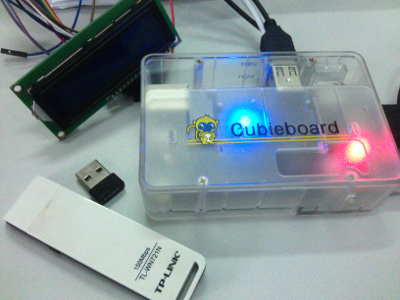
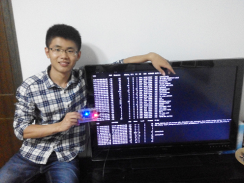

# FreeBox #

## What is FreeBox? ##
FreeBox is a device to crack WIFI. The hardware is mainly a Cubieboard2(with linux) and the software is based on the code from Reaver.

## How is it going? ##
This project is divided into two stages. We just went through Stage1 successfully.

### Stage 1: ###
In this stage, our aim is to setup the building environment and to comfirm the viability. We do nothing but make existing projects functional. We would like to install Linux on cubieboard, update the kernel for the sake of experiment. Then we download, compile and install the aircrack-ng package and reaver package, and give those tools a try on Cubieboard.

If you want to follow up with me, please check [here](#How-to). Later, when I complete the task successfully, the approaches will be documented.

### Stage 2: ###
If Stage1 is a success, it means that we can crack wifi with the board. But that's not FreeBox! We don't want to carry a screem and keyboard when we doing crack outdoors. The solution is to reconstruct the reaver tool package and some other tools related to be suitble for cubieboard. To achieve the target, we alse need to build drivers for 1602A and a portable input device.

## Notice ##
It is **illegal** to crack other users' WIFI without permission!

## How-to ##

### Install Cubian ###
Download Cubian. Then make SDcard installation:

    dd if=PATH_TO_CUBIAN of=/dev/YOUR_DEVICE bs=4096; sync
    
Be careful that YOUR_DEVICE is the root. I get `sdb` and `sdb0` in with `ls` in `dev` directory. `sdb` is the one, sdb0 is only one partition.

After boot from SDcard, run the command below can install the system on NAND automatically.

    sudo ~/nandinstall/install.sh
    
As the author of Cubian said, it is a good idea to keep Cubian up-to-date with command:

    sudo cubian-update -v

However, error occurs in update process. I still miss some kernel headers to compile kernel modules.

    sudo apt-get install linux-headers
   
There is no fit. I install a header that is newer than my kernel, then update my kernel.

    sudo apt-get install linux-image

Done!

### Compule aircrack-ng ###
Check documentation INSTALLING about the requirements may save me a lot of time compiling the source code!

### Install Reaver ###
Reaver is ready contained by my distro source, to install:

    sudo apt-get install reaver

### Wireless Adaptor ###

We need a USB wireless adaptor to continue our work.

If your wireless device is supported by the system, all you need to do is simply pluging in the device. Some of us will not be that lucky, they should build their own drivers. Just for your information, we have already known that adaptors using rtl8188eu are supported by Cubian currently but 9271 (e.g. TL-WN721N) are not. 

A safe way to compile a driver module is using the source tree. We recommand you to compile the source thuroughly if you are struggling problem with kenerl module versioning. BACK UP YOUR DATA BEFORE ACTION.

Click here

### Wireless Adaptor Capacity ###

Not all adaptors are suitable for this job. We need those which can work in `Monitor Mode`. To test your adaptor, run:

	iwlist

If the results contains `* Monitor`, that's it!

FYI, to change mode, run `ifconfig wlan0 down` before running `iwconfig wlan0 mode monitor`, or the modification will fail. Then `ifconfig wlan0 up`. However, in  FreeBox, airmon-ng will do the job.

### Interaction(optional) ###

In stage 1, we don't have any interface to manipulate the device without a screen and a keyboard. To make the 'Box in Stage1' more playful, we plan to using an Android device to control it. It needs extra wireless adaptor. 

- Have BusyBox and terminal-emulator installed in the Android.
- Setup HotPot in Android.
- Setup the extra adaptor, enabling it connect the hotpot automatically. Use static IP address.
- In the terminal-emulator, using ssh to connect cubieboard and the phone: `ssh cubie@<IP Address> -p 36000`

Well, now you can do some test, in everywhere :D
